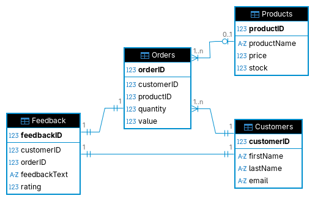

# Final Project - CRM System
Project Brief: Design and implement a Customer Realationship Management (CRM) System

## Requirements
- Create tables for Customers, Orders, Products and Feedback
- Design the database schema with appropriate relationships and constraints
- Implement CRUD operations for each table
- Write queries to generate reports on customer orders, product sales and customer feedback analytics

### Initial Thoughts
Looking at these requirements, I make the assumption that the project involves implementing the database in a Python app. I would create the database and tables in DBeaver, and create a script and ERD for the database schema with relationships and constraints. I would then create the python file - probably called main.py - and set up the connection with sqlite3 (I enjoy using MySQL and hope to also try PostgreSQL at some point, but sqlite3 is nice and easy to implement in Python projects.) After this, I would add to the python file to create some functions for basic CRUD operations using a cursor. I think for the final requirement, I will again use python functions to make those queries, but also write them in DBeaver scripts.
I imagine the final database may look fairly similar to the customer feedback database I did the previous tasks in, but I intend to make a new database for this project from the ground up anyway, to ensure that it is tailor made to this project.
The project looks a little simpler than I expected when I break it down like this, I might start using this method to approach daunting projects more in the future.

### Entities
#### Customers
##### Properties
- customerID [PRIMARY KEY]
- firstName
- lastName
- email
#### Orders
##### Properties
- orderID [PRIMARY KEY]
- customerID [FOREIGN KEY] (one-to-many)
- productID [FOREIGN KEY] (many-to-many)
- quantity
- value
#### Products
##### Properties
- productID [PRIMARY KEY]
- productName
- price
- stock
#### Feedback
##### Properties
- feedbackID [PRIMARY KEY]
- customerID [FOREIGN KEY] (one-to-one)
- orderID [FOREIGN KEY] (one-to-one)
- feedbackText
- rating

### Creating the database
I ran the following script to create the database:
CREATE TABLE Customers(
	customerID INTEGER PRIMARY KEY AUTOINCREMENT,
	firstName TEXT NOT NULL,
	lastName TEXT NOT NULL,
	email TEXT UNIQUE
);

CREATE TABLE Products(
	productID INTEGER PRIMARY KEY AUTOINCREMENT,
	productName TEXT NOT NULL,
	price REAL NOT NULL,
	stock INTEGER
);

CREATE TABLE Orders(
	orderID INTEGER PRIMARY KEY AUTOINCREMENT,
	customerID INTEGER NOT NULL,
	productID INTEGER,
	quantity INTEGER NOT NULL,
	value REAL NOT NULL,
	FOREIGN KEY (customerID) REFERENCES Customers(customerID),
	FOREIGN KEY (productID) REFERENCES Products(productID)
);

CREATE TABLE Feedback(
	feedbackID INTEGER PRIMARY KEY AUTOINCREMENT,
	customerID INTEGER NOT NULL UNIQUE,
	orderID INTEGER NOT NULL UNIQUE,
	feedbackText TEXT,
	rating REAL CHECK(rating >=1 AND rating <=5),
	FOREIGN KEY (customerID) REFERENCES Customers(customerID),
	FOREIGN KEY (orderID) REFERENCES Orders(orderID)
);

and made the ERD located in this project's directory:




### Creating Indexes
I also decided to create some indexes to make some of the more frequently used searches more efficient:

CREATE INDEX idx_price ON Products(price);
CREATE INDEX idx_quantity ON Orders(quantity);
CREATE INDEX idx_customer ON Customers(customerID);

After working further on the reporting queries, I realised the most useful extra indexes for this specific project are on the foreign key columns in Orders, because those are used in joins and grouping a lot:

CREATE INDEX idx_orders_customerID ON Orders(customerID);
CREATE INDEX idx_orders_productID ON Orders(productID);

I kept the original indexes I made, but if I were cleaning this up for production I would likely remove redundant ones like indexing a primary key column directly.

### Implementing in Python
I already had the initial connection code in place, which was:

```python
import sqlite3

def connect_to_db(db_name):
	return sqlite3.connect(db_name)

conn = connect_to_db('final_project.db')
cur = conn.cursor()
```

I kept this approach and built everything else around it.
Since I had already created the database and tables in DBeaver, I did not add database creation logic in Python.

#### Step 1: Build CRUD functions for each table
I implemented full CRUD for:
- Customers
- Products
- Orders
- Feedback

For each entity I followed the same pattern:
- create function using INSERT
- get one record by ID
- get all records
- update by ID
- delete by ID

A simple example from Customers was:

```python
def create_customer(first_name, last_name, email):
	cur.execute(
		"INSERT INTO Customers (firstName, lastName, email) VALUES (?, ?, ?)",
		(first_name, last_name, email)
	)
	conn.commit()
	return cur.lastrowid
```

For updates/deletes I returned rowcount so I could easily confirm whether a row was actually changed.

#### Step 2: Add automatic value calculation for Orders
Originally, Orders.value could be passed in manually, but I changed this so value is always derived from existing data.

Now the create flow is:
- get product price from Products
- multiply price by quantity
- insert order with computed value

Snippet:

```python
cur.execute("SELECT price, stock FROM Products WHERE productID = ?", (product_id,))
price, stock = cur.fetchone()
value = float(price) * int(quantity)
```

I applied the same idea when updating orders, so value is recalculated there as well.

#### Step 3: Keep stock consistent when creating orders
I added a stock check and stock update in order creation:
- if product does not exist, raise ValueError
- if stock is tracked and quantity is too high, raise ValueError
- if order is valid, reduce stock by quantity

Snippet:

```python
if stock is not None and quantity > stock:
	raise ValueError("Insufficient stock for this order.")

cur.execute(
	"UPDATE Products SET stock = stock - ? WHERE productID = ?",
	(quantity, product_id)
)
```

#### Step 4: Implement report query functions
To match the project requirements, I created dedicated report functions for:
- customer orders and total spend
- product sales (units and value)
- feedback analytics (count, average rating, min/max, and distribution)

Example report query pattern:

```sql
SELECT
	c.customerID,
	c.firstName,
	c.lastName,
	COUNT(o.orderID) AS totalOrders,
	COALESCE(SUM(o.value), 0) AS totalSpent
FROM Customers c
LEFT JOIN Orders o ON c.customerID = o.customerID
GROUP BY c.customerID, c.firstName, c.lastName
ORDER BY totalSpent DESC;
```

#### Step 5: Add an interactive CLI walkthrough menu
To make testing and demonstration easier, I added a simple terminal menu in main.py.
This lets me run CRUD and report functions interactively without manually editing code each time.

The menu also includes basic error handling for:
- invalid input values
- constraint/integrity errors
- other sqlite errors

#### Step 6: Add try/except blocks to relevant functions
After this, I added explicit try/except Exception as e blocks in all the relevant Python functions so errors are easier to trace while testing.

I applied this to:
- database connection function
- CRUD functions
- reporting functions
- helper functions (input parsing and printing)
- CLI flow (including an unexpected-error catch)

The pattern I used was:

```python
def create_customer(first_name, last_name, email):
	try:
		cur.execute(
			"INSERT INTO Customers (firstName, lastName, email) VALUES (?, ?, ?)",
			(first_name, last_name, email)
		)
		conn.commit()
		return cur.lastrowid
	except Exception as e:
		print(f"Error in create_customer: {e}")
		raise
```

I kept re-raising the exception so I still get clear failure behaviour, but now I also get function-specific messages that make debugging much easier.


